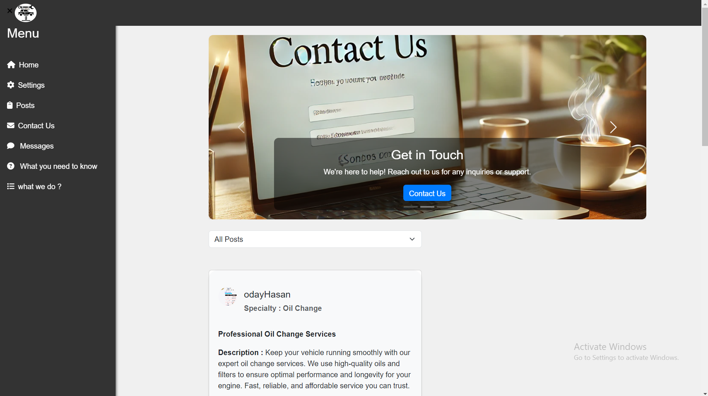

<p align="center">

 

</p>

<h3 align="center">Bansharji
</h3>

---

<p align="center"> 
A car service app streamlines vehicle maintenance by allowing users to  book appointments/ ask for a service.
    <br> 
<a href=''>Demo</a>
    <br> 
</p>

## 📝 Table of Contents

- [About](#about)
- [Getting Started](#getting_started)
- [Usage](#usage)
- [Built Using](#built_using)
- [User Story](#user_story)
- [Data Flow](#data_flow)
- [Guided By](#guided_by)

## 🧐 About <a name = "about"></a>

How many of us have had our car break down on the side of the road or highway, with the nearest body shop or garage an hour or two away, and needed a tow truck even though the issue was as simple as a tire puncture? Well,<b> Bansharji</b> solves all these problems. Now, you can connect with a top-notch mechanic who, once you call or text, will be on their way to fix your problem.<b> Bansharji</b>has the best experts in every field to ensure you get the highest quality service, saving you both time and money.

## 🏁 Getting Started <a name = "getting_started"></a>

These instructions will get you a copy of the project up and running on your local machine for development and testing purposes.

### Prerequisites

- Visual Studio Code follow this <a href='https://code.visualstudio.com/download'>link</a> to install.
- Git Bash follow this <a href='https://git-scm.com/downloads'>link</a> to install.
- MongoDB follow this <a href='https://www.mongodb.com/try/download/community'>link</a> to install.
- Node.js follow this <a href='https://nodejs.org/en/download/package-manager'>link</a> to install.

### Installing:

1. Clone the repo to your local machine using git bash.

```
git clone https://github.com/C11-AhmadAzmii/MERAKI_Academy_Project_4.git
```

2. Install packeges repeat this step in backend and frontend folder

```
npm i
```

3. Run server using git bash inside backend folder

```
npm run dev
```

4. Run application using git bash inside frontend folder

```
npm run start
```

Now app ready to use 



## 🎈 Usage <a name="usage"></a>

- First if you want to add a review or contact any of the provider you need to click on any button so you can login/register .
.png) 

.png)
- Here you can login or go to the register page if you don't have an account.
.png)
- In the registration page you can choice between if you want to be a user or a provider by clicking on this check box.
.png)
- Here is the Dashboard for either if you are a user or a provider.Enjoy exploring the page 🧐 .
- User :
.png)
- Provider :
.png)
- Now if you want to change any of your information you can easily click on the setting so you can pick your image or any other information 
.png)

## ⛏️ Built Using <a name = "built_using"></a>

- [MongoDB](https://www.mongodb.com/) - Database
- [Express JS](https://expressjs.com/) - Server Framework
- [React JS](https://https://reactjs.org/) - Web Framework
- [Node JS](https://nodejs.org/en/) - Server Environment

## User Story <a name = "#user_story"></a>

Your trello board link
<a href='https://trello.com/b/dUQ3NF0k/maintenance-services-app'>Trello</a>

## Data Flow <a name = "#data_flow"></a>

</a>

## ⚠️ Guided By <a name = "guided_by"></a>

This project is guided by ©️ **[MERAKI Academy](https://www.meraki-academy.org)**